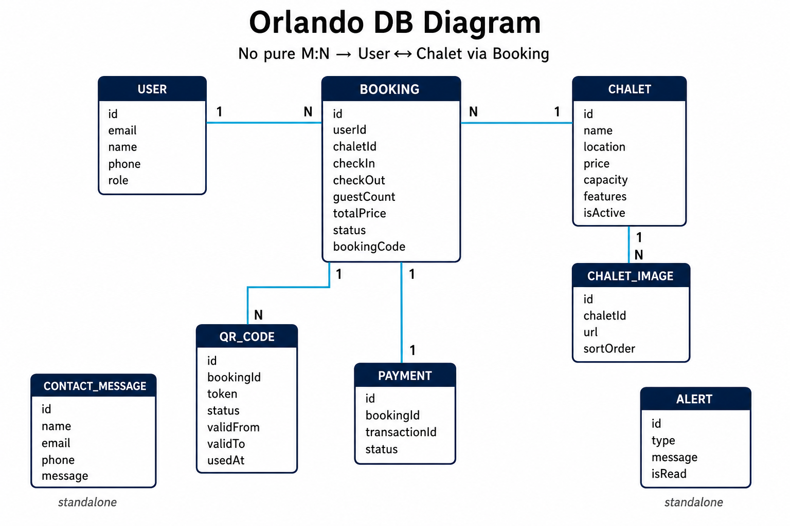
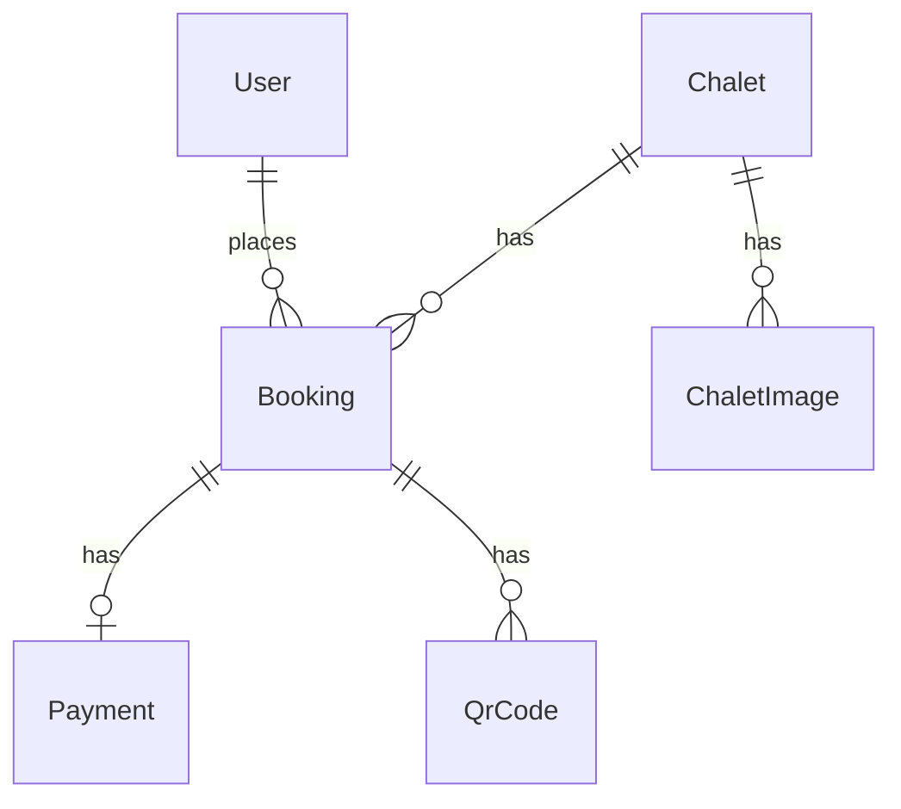

# الكيانات المستخرجة من متطلبات أورلاندو

مستخرجة من [`REQUIREMENTS.md`](./REQUIREMENTS.md).

---

## DB Diagram (ER)



### Mermaid (نسخة نصية بديلة)



---

## جدول العلاقات (Cardinality)

| من | إلى | النوع | الشرح |
|---|---|---|---|
| User → Booking | **1 : N** | مستخدم واحد يعمل أكثر من حجز |
| Chalet → Booking | **1 : N** | شاليه واحد له أكثر من حجز عبر الزمن |
| Chalet → ChaletImage | **1 : N** | شاليه واحد له عدة صور |
| Booking → Payment | **1 : 1** | كل حجز له دفعة واحدة (`bookingId` unique) |
| Booking → QrCode | **1 : N** | عادة QR واحد نشط؛ إعادة الإصدار تضيف سجلات |
| ContactMessage | — | مستقل |
| Alert | — | مستقل (على مستوى النظام للأدمن) |

### هل في Many-to-Many؟

**مفيش جدول M:N صريح** في المرحلة دي.

لكن منطقياً:

- **User ↔ Chalet** علاقة **Many-to-Many عبر Booking**
  - عميل يحجز أكثر من شاليه
  - شاليه يتحجز من أكثر من عميل
  - `Booking` مش مجرد join table؛ كيان كامل فيه تواريخ وسعر وحالة وQR

```
User  * ──── Booking ──── *  Chalet
              │
         (entity وسيط بقيمته)
```

---

## 1. User

| الحقل | النوع | ملاحظات |
|---|---|---|
| id | UUID/CUID | PK |
| email | string | unique, required |
| name | string | الاسم الكامل |
| phone | string | رقم الجوال |
| passwordHash | string | bcrypt |
| role | string | `ADMIN` \| `TENANT` (stored as string, validated in app) |
| createdAt / updatedAt | datetime | |

## 2. Chalet

| الحقل | النوع | ملاحظات |
|---|---|---|
| id | UUID/CUID | PK |
| name | string | |
| description | string | |
| location | string | المنطقة |
| price | decimal | سعر الليلة (SAR) |
| capacity | int | أقصى عدد ضيوف |
| rating | float? | اختياري |
| features | JSON string[] | مميزات |
| isActive | boolean | ظاهر للحجز إن true |
| createdAt / updatedAt | datetime | |

بدون `ownerId` في المرحلة الأولى.

## 3. ChaletImage

| الحقل | النوع | ملاحظات |
|---|---|---|
| id | UUID/CUID | PK |
| chaletId | FK → Chalet | cascade delete |
| url | string | مسار/رابط الصورة |
| sortOrder | int | ترتيب العرض |

## 4. Booking

| الحقل | النوع | ملاحظات |
|---|---|---|
| id | UUID/CUID | PK |
| userId | FK → User | العميل |
| chaletId | FK → Chalet | |
| checkIn | date | |
| checkOut | date | |
| guestCount | int | ≥ 1 و ≤ capacity |
| specialRequests | string? | |
| totalPrice | decimal | ليالي × سعر |
| status | string | `PENDING` \| `CONFIRMED` \| `CANCELLED` |
| bookingCode | string | unique (مثل ORD-XXXXXX) |
| createdAt / updatedAt | datetime | |

قاعدة: لا تداخل تواريخ لنفس الشاليه لأي حجز غير `CANCELLED`.

## 5. QrCode

| الحقل | النوع | ملاحظات |
|---|---|---|
| id | UUID/CUID | PK |
| bookingId | FK → Booking | |
| token | string | unique |
| status | string | `ACTIVE` \| `USED` \| `EXPIRED` \| `REVOKED` |
| validFrom | datetime/date | = checkIn |
| validTo | datetime/date | = checkOut |
| usedAt | datetime? | عند أول مسح ناجح |
| createdAt | datetime | |

دورة الحياة: ACTIVE → USED (مرة واحدة) | EXPIRED | REVOKED.

## 6. Payment

| الحقل | النوع | ملاحظات |
|---|---|---|
| id | UUID/CUID | PK |
| bookingId | FK → Booking | unique (واحد لكل حجز) |
| transactionId | string | unique |
| status | string | `SUCCESS` \| `FAILED` |
| createdAt | datetime | |

Stub في المرحلة الأولى (SUCCESS افتراضي).

## 7. ContactMessage

| الحقل | النوع | ملاحظات |
|---|---|---|
| id | UUID/CUID | PK |
| name | string | |
| email | string | |
| phone | string | |
| message | string | |
| createdAt | datetime | |

## 8. Alert

| الحقل | النوع | ملاحظات |
|---|---|---|
| id | UUID/CUID | PK |
| type | string | `INFO` \| `WARNING` \| `ERROR` |
| message | string | |
| isRead | boolean | default false |
| createdAt | datetime | |

لإشعارات Admin Dashboard. تُنشأ مثلاً عند حجز جديد.

---

## ملاحظات تقنية

- القيم الـ enum-like تُخزَّن كـ `String` وتُفرض في طبقة التطبيق (`src/lib/constants.ts`).
- Database: **PostgreSQL** (Prisma provider `postgresql`).

## خارج النطاق (مرحلة لاحقة)

- Owner / ملكية شاليهات متعددة (هتظهر علاقات جديدة مع User/Chalet)
- QrScanAttempt (audit لكل محاولة مسح)
- CMS للجداول التسويقية (Services, FAQ, Reviews)
- Forgot password
